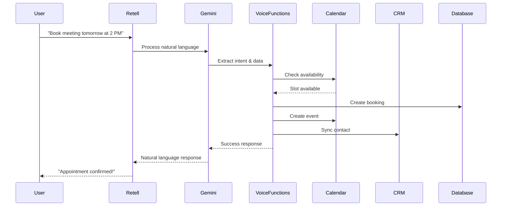

# Voice Integration with Calendar & CRM Access

## Overview

The Metalogics AI Assistant now has full voice integration with real-time calendar access and HubSpot CRM synchronization. Users can check availability, book meetings, reschedule appointments, and manage their calendar entirely through natural voice conversations.

## 🎯 Key Features

### 1. Real-Time Calendar Access

- **Check Availability**: Query Google Calendar for open time slots
- **View Busy Slots**: See when the calendar is occupied
- **Smart Scheduling**: Respects business hours and buffer times
- **Conflict Prevention**: Prevents double-booking automatically

### 2. Full Appointment Management

- **Book Meetings**: Create calendar events with automatic invites
- **Reschedule**: Move appointments to new times
- **Cancel**: Remove appointments and free up slots
- **List Appointments**: View upcoming scheduled meetings

### 3. HubSpot CRM Integration

- **Contact Sync**: Automatically create/update contacts
- **Booking History**: Track all appointments per contact
- **Status Updates**: Log booking status changes
- **Lead Management**: Capture and qualify leads through voice

## 🏗️ Architecture

### Service Layer

```
┌─────────────────────────────────────────────────────────────┐
│                    Voice Assistant (Retell AI)              │
└────────────────────┬────────────────────────────────────────┘
                     │
                     ▼
┌─────────────────────────────────────────────────────────────┐
│              Gemini AI (Natural Language)                   │
└────────────────────┬────────────────────────────────────────┘
                     │
                     ▼
┌─────────────────────────────────────────────────────────────┐
│           ConversationService (Intent Detection)            │
└────────────────────┬────────────────────────────────────────┘
                     │
                     ▼
┌─────────────────────────────────────────────────────────────┐
│         VoiceFunctionsService (Calendar & CRM)              │
└──────┬──────────────┬──────────────┬────────────────────────┘
       │              │              │
       ▼              ▼              ▼
┌──────────┐   ┌──────────┐   ┌──────────┐
│ Calendar │   │ Booking  │   │   CRM    │
│ Service  │   │ Service  │   │ Service  │
└────┬─────┘   └────┬─────┘   └────┬─────┘
     │              │              │
     ▼              ▼              ▼
┌──────────┐   ┌──────────┐   ┌──────────┐
│  Google  │   │PostgreSQL│   │ HubSpot  │
│ Calendar │   │ Database │   │   CRM    │
└──────────┘   └──────────┘   └──────────┘
```

### Key Components

1. **VoiceFunctionsService** (`backend/src/services/voice-functions.service.ts`)

   - Provides callable functions for voice assistant
   - Coordinates calendar, booking, and CRM operations
   - Handles error recovery and graceful degradation

2. **RetellLLMService** (`backend/src/services/retell-llm.service.ts`)

   - WebSocket handler for Retell AI
   - Streams responses from Gemini
   - Routes to appropriate services

3. **GeminiService** (`backend/src/services/gemini.service.ts`)

   - Natural language understanding
   - Enhanced system prompt with calendar/CRM context
   - Conversation management

4. **CalendarService** (`backend/src/services/calendar.service.ts`)

   - Google Calendar API integration
   - Availability checking
   - Event management

5. **CRMService** (`backend/src/services/crm.service.ts`)
   - HubSpot API integration
   - Contact synchronization
   - Booking history tracking

## 📋 Available Voice Functions

### 1. Check Availability

**Function**: `checkAvailability`

**Parameters**:

- `date` (required): Date to check (YYYY-MM-DD)
- `duration` (optional): Meeting duration in minutes (default: 30)

**Returns**:

- List of available time slots
- Formatted times for voice response

**Example Voice Interaction**:

```
User: "What times are available tomorrow?"
AI: "Tomorrow I have slots available at 9:00 AM, 10:00 AM, 2:00 PM, and 4:00 PM. Which time works best for you?"
```

### 2. Book Appointment

**Function**: `bookAppointment`

**Parameters**:

- `name` (required): Full name
- `email` (required): Email address
- `phone` (optional): Phone number
- `company` (optional): Company name
- `date` (required): Appointment date (YYYY-MM-DD)
- `time` (required): Appointment time (HH:MM)
- `duration` (optional): Duration in minutes (default: 30)
- `inquiry` (optional): Purpose of meeting

**Actions**:

1. Creates booking in database
2. Creates Google Calendar event
3. Sends email confirmation with calendar invite
4. Syncs contact to HubSpot CRM
5. Updates CRM with booking details

**Example Voice Interaction**:

```
User: "I'd like to book a meeting for tomorrow at 2 PM"
AI: "Great! I can book that for you. What's your name?"
User: "John Smith"
AI: "And your email address?"
User: "john@example.com"
AI: "Perfect! I'm booking a 30-minute meeting for you tomorrow at 2:00 PM. Is that correct?"
User: "Yes"
AI: "Done! Your appointment is confirmed. You'll receive a confirmation email at john@example.com with a calendar invite."
```

### 3. Reschedule Appointment

**Function**: `rescheduleAppointment`

**Parameters**:

- `email` (required): Email used for booking
- `bookingId` (optional): Specific booking ID
- `newDate` (required): New date (YYYY-MM-DD)
- `newTime` (required): New time (HH:MM)

**Actions**:

1. Finds existing booking by email
2. Checks new time slot availability
3. Updates booking in database
4. Updates Google Calendar event
5. Sends updated confirmation email
6. Updates HubSpot CRM record

**Example Voice Interaction**:

```
User: "I need to reschedule my appointment"
AI: "I can help with that. What's your email address?"
User: "john@example.com"
AI: "I found your appointment on December 10th at 2:00 PM. What new date would you like?"
User: "December 12th at 3 PM"
AI: "Let me check availability... Yes, 3:00 PM on December 12th is available. Should I move your appointment?"
User: "Yes please"
AI: "Done! Your appointment has been rescheduled to December 12th at 3:00 PM. You'll receive an updated confirmation email."
```

### 4. Cancel Appointment

**Function**: `cancelAppointment`

**Parameters**:

- `email` (required): Email used for booking
- `bookingId` (optional): Specific booking ID

**Actions**:

1. Finds existing booking by email
2. Cancels booking in database
3. Deletes Google Calendar event
4. Sends cancellation email
5. Updates HubSpot CRM status

**Example Voice Interaction**:

```
User: "I need to cancel my appointment"
AI: "I can help with that. What's your email address?"
User: "john@example.com"
AI: "I found your appointment on December 10th at 2:00 PM. Are you sure you want to cancel?"
User: "Yes"
AI: "Your appointment has been cancelled. You'll receive a cancellation confirmation email. Would you like to book a new appointment?"
```

### 5. Get Upcoming Appointments

**Function**: `getUpcomingAppointments`

**Parameters**:

- `email` (required): Email address

**Returns**:

- List of upcoming appointments
- Dates, times, and durations

**Example Voice Interaction**:

```
User: "What appointments do I have coming up?"
AI: "What's your email address?"
User: "john@example.com"
AI: "You have 2 upcoming appointments: 1) December 10th at 2:00 PM for 30 minutes, and 2) December 15th at 10:00 AM for 60 minutes."
```

### 6. Update CRM Contact

**Function**: `updateCRMContact`

**Parameters**:

- `email` (required): Email address
- `name` (optional): Full name
- `phone` (optional): Phone number
- `company` (optional): Company name
- `notes` (optional): Additional notes

**Actions**:

1. Creates or updates HubSpot contact
2. Syncs all provided information
3. Logs interaction in CRM

## 🔧 Configuration

### Environment Variables

```bash
# Google Calendar
GOOGLE_CALENDAR_ENABLED=true
GOOGLE_SERVICE_ACCOUNT_EMAIL=your-service-account@project.iam.gserviceaccount.com
GOOGLE_SERVICE_ACCOUNT_KEY_PATH=path/to/service-account-key.json
GOOGLE_CALENDAR_ID=your-calendar-id@group.calendar.google.com
GOOGLE_CALENDAR_TIMEZONE=Europe/London

# HubSpot CRM
HUBSPOT_ENABLED=true
HUBSPOT_ACCESS_TOKEN=pat-na1-xxxxx-xxxx-xxxx-xxxx-xxxxxxxxxxxx

# Retell AI
RETELL_API_KEY=key_xxxxxxxxxxxxxxxxxxxxx
RETELL_AGENT_ID=agent_xxxxxxxxxxxxxxxxxxxxx
RETELL_ENABLED=true

# Gemini AI
GEMINI_API_KEY=AIzaSyXXXXXXXXXXXXXXXXXXXXXXXXXXXXXX

# Business Hours
BUSINESS_DAYS=1,2,3,4,5  # Monday-Friday
BUSINESS_START_HOUR=9
BUSINESS_END_HOUR=17
BUSINESS_TIMEZONE=Europe/London
BUFFER_MINUTES=15
MIN_ADVANCE_HOURS=1
MAX_ADVANCE_HOURS=24
```

### Business Rules

- **Business Hours**: Monday-Friday, 9 AM - 5 PM (Europe/London)
- **Buffer Time**: 15 minutes between appointments
- **Advance Booking**: 1-24 hours in advance
- **Meeting Durations**: 15, 30, 45, or 60 minutes
- **Default Duration**: 30 minutes

## 🧪 Testing

### Test Calendar Availability

```bash
curl -X POST http://localhost:3000/api/retell/function \
  -H "Content-Type: application/json" \
  -d '{
    "name": "check_availability",
    "args": {
      "date": "2024-12-10",
      "duration": 30
    }
  }'
```

### Test Booking

```bash
curl -X POST http://localhost:3000/api/retell/function \
  -H "Content-Type: application/json" \
  -d '{
    "name": "book_appointment",
    "args": {
      "name": "John Smith",
      "email": "john@example.com",
      "phone": "+1234567890",
      "company": "Acme Corp",
      "date": "2024-12-10",
      "time": "14:00",
      "duration": 30
    }
  }'
```

### Test Reschedule

```bash
curl -X POST http://localhost:3000/api/retell/function \
  -H "Content-Type: application/json" \
  -d '{
    "name": "reschedule_appointment",
    "args": {
      "email": "john@example.com",
      "newDate": "2024-12-12",
      "newTime": "15:00"
    }
  }'
```

## 🔍 Monitoring & Logging

All voice interactions are logged with:

- Session ID
- User intent
- Function calls
- Calendar operations
- CRM updates
- Errors and warnings

Check logs at: `backend/logs/app.log`

## 🚨 Error Handling

### Graceful Degradation

1. **Calendar API Failure**: Booking continues without calendar event
2. **CRM API Failure**: Booking continues without CRM sync
3. **Email Failure**: Booking continues, error logged
4. **Gemini Failure**: Falls back to rule-based responses

### User-Friendly Error Messages

- "I'm having trouble connecting to the calendar right now"
- "That time slot just became unavailable, let me suggest alternatives"
- "I couldn't update the CRM, but your booking is confirmed"

## 📊 Performance

- **Calendar Queries**: Cached for 5 minutes
- **CRM Lookups**: Cached for 30 minutes
- **WebSocket Latency**: < 100ms typical
- **Booking Creation**: < 2 seconds end-to-end

## 🔐 Security

- API keys stored in environment variables
- Service account authentication for Google Calendar
- Private app access token for HubSpot
- Rate limiting on all endpoints
- Input validation and sanitization

## 🎤 Voice Conversation Tips

### Best Practices

1. **Be Conversational**: The AI understands natural language
2. **One Step at a Time**: Provide information when asked
3. **Confirm Details**: Always confirm before finalizing
4. **Ask for Help**: Say "help" or "what can you do?"

### Example Conversations

**Quick Booking**:

```
User: "Book a meeting for tomorrow at 2 PM"
AI: "I'd be happy to help! What's your name?"
User: "Sarah Johnson"
AI: "And your email?"
User: "sarah@company.com"
AI: "Perfect! Booking a 30-minute meeting for tomorrow at 2 PM. Confirm?"
User: "Yes"
AI: "Done! Confirmation sent to sarah@company.com"
```

**Check Availability First**:

```
User: "What times are available next Monday?"
AI: "Next Monday I have slots at 9 AM, 10 AM, 2 PM, 3 PM, and 4 PM"
User: "Book me for 10 AM"
AI: "Great choice! What's your name?"
[continues with booking flow]
```

## 🔄 Integration Flow



## 📚 Additional Resources

- [Retell AI Documentation](https://docs.retellai.com/)
- [Google Calendar API](https://developers.google.com/calendar)
- [HubSpot API](https://developers.hubspot.com/)
- [Gemini AI](https://ai.google.dev/)

## 🆘 Troubleshooting

### Calendar Not Syncing

1. Check `GOOGLE_CALENDAR_ENABLED=true`
2. Verify service account credentials
3. Ensure calendar is shared with service account
4. Check logs for authentication errors

### CRM Not Updating

1. Check `HUBSPOT_ENABLED=true`
2. Verify access token is valid
3. Ensure required scopes are granted
4. Check HubSpot API rate limits

### Voice Not Working

1. Verify Retell API key
2. Check WebSocket connection
3. Ensure Gemini API key is valid
4. Review server logs for errors

## 🎉 Success Metrics

Track these metrics to measure success:

- Booking completion rate via voice
- Average conversation length
- Calendar sync success rate
- CRM sync success rate
- User satisfaction scores
